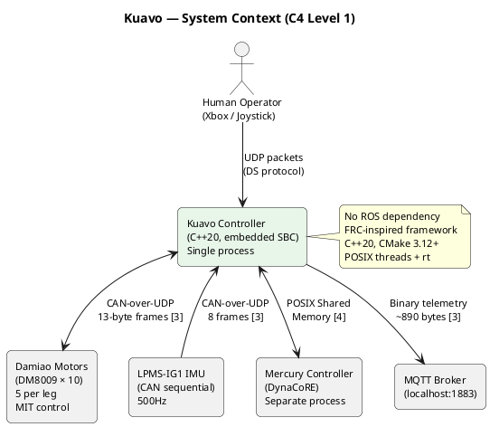
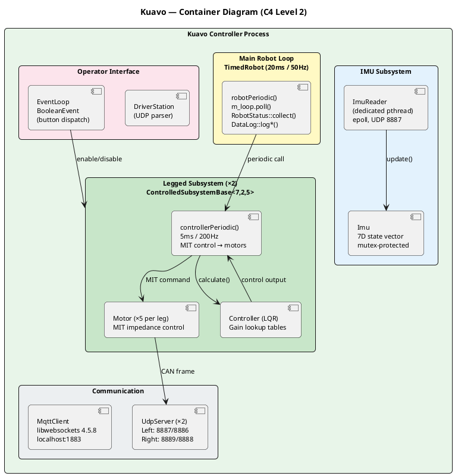
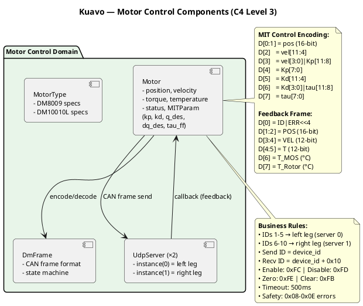
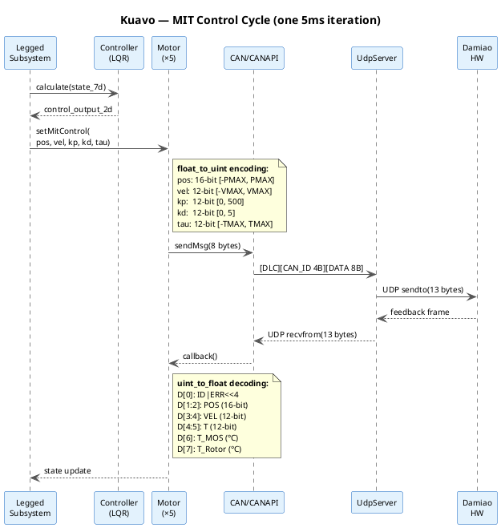
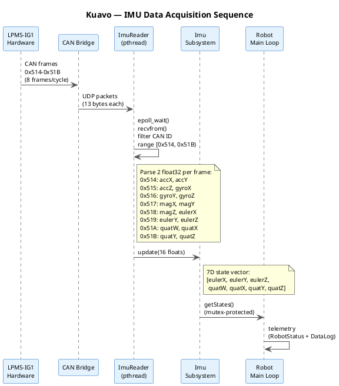

# Kuavo Bipedal Robot Controller - Architecture Diagrams

C4-inspired architecture diagrams for the Kuavo controller software.
Generated from codebase analysis.

---

## Level 1: System Context

Who/what interacts with the Kuavo controller and what are the boundaries.

```
                                    +-----------------------+
                                    |     Human Operator    |
                                    |  (Xbox / Joystick)    |
                                    +----------+------------+
                                               |
                                               | UDP packets
                                               | (DS protocol)
                                               v
+------------------+   CAN-over-UDP   +=============================+   CAN-over-UDP   +------------------+
|   Damiao Motors  | <---------------> |                             | <---------------> |   LPMS-IG1 IMU   |
|  (DM8009 x10)   |   13-byte frames  |   Kuavo Robot Controller   |   13-byte frames  |  (CAN sequential)|
|  MIT control     |                   |   (C++20, single process)  |                   |  16 float values |
+------------------+                   |                             |                   +------------------+
                                       +=============================+
                                               |
                                               | MQTT (binary)
                                               | libwebsockets
                                               v
                                       +------------------+
                                       |   MQTT Broker    |
                                       | (Mosquitto etc.) |
                                       +------------------+
                                               |
                                               v
                                       +------------------+
                                       | Monitoring / UI  |
                                       | (telemetry       |
                                       |  consumers)      |
                                       +------------------+
```

**Key points:**
- The Kuavo controller is a **single C++20 process** running on an embedded Linux SBC
- **Two CAN buses** (one per leg) are bridged over UDP to the controller
- The IMU communicates over a **separate UDP port** using the same 13-byte CAN frame format
- The **Driver Station** (operator console) sends control mode + joystick data via UDP
- **MQTT** carries telemetry out (binary robot status snapshots, ~890 bytes per frame)
- No ROS dependency; the framework is FRC-inspired (WPILib patterns)

---

## Level 2: Container Diagram

Runnable/deployable units and their communication protocols.

```
+============================================================================+
|                        Kuavo Controller Process                            |
|                        (single binary: src/Robot.cpp main())               |
|                                                                            |
|  +------------------+    +------------------+    +----------------------+  |
|  |   TimedRobot     |    |  EventLoop +     |    |    MqttClient        |  |
|  |   Main Loop      |    |  BooleanEvent    |    |  (libwebsockets)     |  |
|  |  (5ms period)    |    |  (button/input   |    |                      |  |
|  |                  |    |   dispatch)      |    | publishes to broker  |  |
|  +--------+---------+    +--------+---------+    +----------+-----------+  |
|           |                       |                         ^              |
|           | calls robotPeriodic   | polls                   | binary       |
|           v                       v                         | payload      |
|  +------------------+    +------------------+    +----------+-----------+  |
|  | Legged Subsystem |    | DriverStation    |    |    RobotStatus       |  |
|  | (x1 active,      |    | (FRC DS parser)  |    |  (telemetry          |  |
|  |  x1 commented)   |    |                  |    |   collector)         |  |
|  +--------+---------+    +------------------+    +----------------------+  |
|           |                       ^                                        |
|           | MIT commands          | UDP :61123                             |
|           v                       |                                        |
|  +------------------+    +------------------+                              |
|  | Motor (x5/leg)   |    |  Imu Subsystem   |                             |
|  | via CAN class    |    |  (ImuReader)      |                             |
|  +--------+---------+    +--------+---------+                              |
|           |                       |                                        |
+===========|=======================|========================================+
            |                       |
            | CAN-over-UDP          | CAN-over-UDP
            | (13B frames)          | (13B frames)
            v                       v
+-----------+----------+   +--------+---------+
| UdpServer instance 0 |   |  UDP socket      |
| port: baseLocalPort  |   |  port: imu.port  |
| (left leg motors)    |   |  (IMU CAN bridge)|
+-----------+----------+   +------------------+
            |
            | + UdpServer instance 1
            |   (right leg motors)
            v
    +-------+--------+
    | CAN Bus Bridge  |
    | (external HW)   |
    +-------+--------+
            |
            v
    +-------+--------+
    | Damiao Motors   |
    | 1-5 (left)      |
    | 6-10 (right)    |
    +-----------------+
```

**Key points:**
- **Single process**, no inter-process communication -- everything runs in one binary
- **TimedRobot** drives the main loop at 200Hz (5ms period) using a Notifier timer
- **Two UdpServer instances** (singletons) manage CAN-over-UDP for left/right leg motor buses
- **ImuReader** runs its own thread with epoll, receives 8 sequential CAN frames per cycle
- **MqttClient** connects to broker via libwebsockets; RobotStatus publishes binary snapshots
- **DriverStation** receives UDP packets from operator console, parses control words + joystick axes
- Config loaded from `config/config.yaml` via dynacore_yaml-cpp at startup

---

## Level 3: Component Diagram

Internal structure of the Kuavo controller process.

```
Container: Kuavo Controller Process
+===========================================================================+
|                                                                           |
|  ROBOT LIFECYCLE (lib/robot/)                                             |
|  +---------------------------------------------------------------------+ |
|  |                                                                     | |
|  |  RobotBase  -->  IterativeRobotBase  -->  TimedRobot  -->  Robot    | |
|  |  (HAL init,      (loopFunc: mode       (AddPeriodic     (robotInit, | |
|  |   DS refresh)     switch, periodic      callback at      subsystem  | |
|  |                   dispatch)             5ms via          wiring,    | |
|  |                                         Notifier)       buttons)   | |
|  +---------------------------------------------------------------------+ |
|       |               |                |                                  |
|       v               v                v                                  |
|  +-----------+  +----------+  +-------------------+                       |
|  | EventLoop |  | Driver   |  | SubsystemBase     |                       |
|  | + Boolean |  | Station  |  | (registry pattern)|                       |
|  | Event     |  | (UDP     |  | runAll*Periodic() |                       |
|  | (input    |  |  parser) |  | runAll*Init()     |                       |
|  |  binding) |  +----------+  +--------+----------+                       |
|  +-----------+                         |                                  |
|                                        | inherits                         |
|                      +-----------------+------------------+               |
|                      |                                    |               |
|                      v                                    v               |
|  LEGGED SUBSYSTEM                            IMU SUBSYSTEM                |
|  +-------------------------------+   +------------------------+           |
|  | Legged                        |   | Imu                    |           |
|  | ControlledSubsystemBase<7,2,5>|   | SubsystemBase          |           |
|  |                               |   |                        |           |
|  | - motors: vector<Motor> (x5)  |   | - m_reader: ImuReader  |           |
|  | - m_controller: Controller    |   | - m_state: Vector<7>   |           |
|  | - m_motorResponsive[]         |   |   [euler xyz,          |           |
|  | - baseId (1=left, 6=right)    |   |    quat wxyz]          |           |
|  |                               |   |                        |           |
|  | robotPeriodic():              |   | getStates():           |           |
|  |   MIT control -> motors       |   |   reads from ImuReader |           |
|  |   health monitoring           |   |   returns Vector<7>    |           |
|  +------+--------+---------------+   +-------+----------------+           |
|         |        |                           |                            |
|         |        |                           v                            |
|         |        |                   +----------------+                   |
|         |        |                   | ImuReader      |                   |
|         |        |                   | (own thread,   |                   |
|         |        |                   |  epoll loop,   |                   |
|         |        |                   |  UDP socket)   |                   |
|         |        |                   | CAN IDs:       |                   |
|         |        |                   |  0x514..0x51B  |                   |
|         |        |                   | 2 floats/frame |                   |
|         |        |                   +----------------+                   |
|         |        |                                                        |
|         v        v                                                        |
|  MOTOR CONTROL (lib/motor/)                                               |
|  +---------------------------------------------------------------------+ |
|  |                                                                     | |
|  |  Motor                          CAN                                 | |
|  |  +---------------------------+  +----------------------------+      | |
|  |  | - m_deviceId              |  | writePacket()              |      | |
|  |  | - m_motorType (DM8009/    |  | readPacketNew/Latest/      |      | |
|  |  |     DM10010L)             |  |   Timeout()               |      | |
|  |  | - position/velocity/      |  | registrateCallback()      |      | |
|  |  |   torque state            |  +-------------+--------------+      | |
|  |  |                           |                |                     | |
|  |  | enableMotor()             |                v                     | |
|  |  | disableMotor()            |  CANAPI (HAL layer)                  | |
|  |  | setMitControl(MITParam)   |  +----------------------------+     | |
|  |  | callback(msg) [async]     |  | HAL_InitializeCAN()        |     | |
|  |  +---------------------------+  | HAL_WriteCANPacket()        |     | |
|  |                                 | HAL_ReadCANPacket*()        |     | |
|  |  Common.h                       | CANStorage (per-device)     |     | |
|  |  +---------------------------+  | CANFrameId routing          |     | |
|  |  | MotorType: DM8009/10010L  |  +-------------+--------------+     | |
|  |  | ControlMode: MIT/PosVel/  |                |                    | |
|  |  |   Vel/TorquePos           |                v                    | |
|  |  | LimitParam: pMax/vMax/    |  UdpServer (x2 instances)           | |
|  |  |   tMax per type           |  +----------------------------+     | |
|  |  | MITParam: kp,kd,q,dq,tau |  | - UDP socket (send/recv)   |     | |
|  |  | DmFrame.h: wire formats  |  | - epoll receiver thread    |     | |
|  |  +---------------------------+  | - 13-byte CAN frame codec  |     | |
|  |                                 | - callback dispatch to     |     | |
|  |  Utility                        |   Motor::callback()        |     | |
|  |  +---------------------------+  | - instance(0) = left leg   |     | |
|  |  | doubleToUint / uintTo     |  | - instance(1) = right leg  |     | |
|  |  |   Double (bit packing)   |  +----------------------------+     | |
|  |  +---------------------------+                                      | |
|  +---------------------------------------------------------------------+ |
|                                                                           |
|  CONTROLLER (src/controllers/)                                            |
|  +---------------------------------------------------------------------+ |
|  |  ControllerBase<States,Inputs,Outputs>                              | |
|  |  +---------------------------+                                      | |
|  |  | m_r: reference vector     |  Controller (7-state, 2-input)       | |
|  |  | m_u: control output       |  +----------------------------+      | |
|  |  | calculate(x) -> u         |  | Eigen-based state-space    |      | |
|  |  | calculate(x, r) -> u      |  | (LQR placeholder)          |      | |
|  |  +---------------------------+  +----------------------------+      | |
|  |                                                                     | |
|  |  ArmController (7-state, 2-input)                                   | |
|  |  +----------------------------+                                     | |
|  |  | DOF6Kinematic (FK/IK)      |                                     | |
|  |  | DH parameters, joint solve |                                     | |
|  |  +----------------------------+                                     | |
|  +---------------------------------------------------------------------+ |
|                                                                           |
|  TELEMETRY (lib/telemetry/)                                               |
|  +---------------------------------------------------------------------+ |
|  |  RobotStatus                    MqttClient                          | |
|  |  +---------------------------+  +----------------------------+      | |
|  |  | collect(leftMotors,       |  | libwebsockets-based        |      | |
|  |  |   rightMotors, imuState)  |  | publish(topic, payload)    |      | |
|  |  | publish() -> MQTT binary  |  | subscribe()                |      | |
|  |  |                           |  | isConnected()              |      | |
|  |  | RobotStatusWire (~890B):  |  +----------------------------+      | |
|  |  |   magic + version         |                                      | |
|  |  |   timestamp + frameId     |  DataLog                             | |
|  |  |   2x LegStatusWire        |  +----------------------------+      | |
|  |  |   DriverCommandWire       |  | logDriverStation()         |      | |
|  |  |   ImuWire (pitch/roll/yaw)|  | logMotors()                |      | |
|  |  +---------------------------+  | logImu()                   |      | |
|  |                                 +----------------------------+      | |
|  +---------------------------------------------------------------------+ |
|                                                                           |
|  CONFIGURATION (lib/common/)                                              |
|  +---------------------------------------------------------------------+ |
|  |  Config (singleton, YAML)       Synchronization (WPI events)        | |
|  |  +---------------------------+  +----------------------------+      | |
|  |  | mqtt: host, port, topics  |  | wpi::Event / Semaphore     |      | |
|  |  | udp: IPs, ports           |  | waitForObject()            |      | |
|  |  | imu: baseId, port, type   |  | condition_variable-based   |      | |
|  |  | motor: types, legs,       |  +----------------------------+      | |
|  |  |   device IDs, limits      |                                      | |
|  |  | logger: path, level       |  TimerManager + Notifier             | |
|  |  +---------------------------+  +----------------------------+      | |
|  |                                 | CLOCK_MONOTONIC timers     |      | |
|  |                                 | timerfd for periodic wake  |      | |
|  |                                 +----------------------------+      | |
|  +---------------------------------------------------------------------+ |
+===========================================================================+
```

**Key points:**
- **Inheritance chain**: `RobotBase` -> `IterativeRobotBase` -> `TimedRobot` -> `Robot` mirrors FRC's lifecycle pattern
- **SubsystemBase** provides a static registry; all subsystems auto-register and get periodic callbacks
- **ControlledSubsystemBase** adds a dedicated pthread with poll-based message queue for async commands
- **Motor** is the central hardware abstraction -- encapsulates Damiao protocol (enable/disable/MIT control/parameter query), receives feedback via CAN callback
- **Two UdpServer singletons** route CAN frames to/from motors; device IDs < `maxCanDevice` go to instance 0 (left), rest to instance 1 (right)
- **ImuReader** is independent of the motor CAN buses -- has its own UDP socket and thread
- **Config** is a singleton loaded from YAML at startup, queried throughout the system

---

## Level 4: Dynamic Diagrams

### 4a. Main Control Loop (one 5ms cycle)

```
TimedRobot          IterativeRobotBase       Robot              Legged           Motor         UdpServer
    |                       |                  |                  |                |               |
    | Notifier fires (5ms)  |                  |                  |                |               |
    +---------------------->|                  |                  |                |               |
    |                       | loopFunc()       |                  |                |               |
    |                       +---+              |                  |                |               |
    |                       |   | refreshData()|                  |                |               |
    |                       |   | mode switch  |                  |                |               |
    |                       |   | check        |                  |                |               |
    |                       |<--+              |                  |                |               |
    |                       |                  |                  |                |               |
    |                       | robotPeriodic()  |                  |                |               |
    |                       +----------------->|                  |                |               |
    |                       |                  | m_loop.poll()    |                |               |
    |                       |                  | (button events)  |                |               |
    |                       |                  |                  |                |               |
    |                       |                  | collect telemetry|                |               |
    |                       |                  +---+              |                |               |
    |                       |                  |   | leftLeg.getMotors()           |               |
    |                       |                  |   | imu.getStates()              |               |
    |                       |                  |<--+              |                |               |
    |                       |                  | m_robotStatus    |                |               |
    |                       |                  |   .publish()     |                |               |
    |                       |                  +--- MQTT -------->|                |               |
    |                       |                  |                  |                |               |
    |                       | runAllRobotPeriodic()               |                |               |
    |                       +------------------------------------>|                |               |
    |                       |                  |                  | controllerPeriodic()           |
    |                       |                  |                  +---+             |               |
    |                       |                  |                  |   | get inputs  |               |
    |                       |                  |                  |<--+             |               |
    |                       |                  |                  |                |               |
    |                       |                  |                  | for each motor:|               |
    |                       |                  |                  | setMitControl  |               |
    |                       |                  |                  | (kp=2,kd=1,   |               |
    |                       |                  |                  |  q=0,dq=0,    |               |
    |                       |                  |                  |  tau=0)       |               |
    |                       |                  |                  +-------------->|               |
    |                       |                  |                  |               | sendMessage() |
    |                       |                  |                  |               +-------------->|
    |                       |                  |                  |               | 13B UDP frame |
    |                       |                  |                  |               |               +---> CAN bus
    |                       |                  |                  |               |               |
    |                       |                  |                  | health check  |               |
    |                       |                  |                  | (stale >500ms)|               |
    |                       |                  |                  +---+           |               |
    |                       |                  |                  |<--+           |               |
```

### 4b. Motor CAN Command & Feedback Cycle

```
Legged         Motor           CAN          CANAPI        UdpServer       CAN Bridge     Damiao Motor
  |              |              |              |              |               |               |
  | setMitControl(MITParam)    |              |              |               |               |
  +------------>|              |              |              |               |               |
  |             | encode MIT:  |              |              |               |               |
  |             | float->uint  |              |              |               |               |
  |             | bit-pack 8B  |              |              |               |               |
  |             | sendMessage()|              |              |               |               |
  |             +---+          |              |              |               |               |
  |             |   | dataframe|              |              |               |               |
  |             |<--+          |              |              |               |               |
  |             | writePacket(data, 8, apiId) |              |               |               |
  |             +------------->|              |              |               |               |
  |             |              | HAL_WriteCANPacket()         |               |               |
  |             |              +------------->|              |               |               |
  |             |              |              | CreateCANId()|               |               |
  |             |              |              | route by     |               |               |
  |             |              |              | deviceId     |               |               |
  |             |              |              | sendMsg()    |               |               |
  |             |              |              +------------->|               |               |
  |             |              |              |              | [1B hdr]      |               |
  |             |              |              |              | [4B CAN ID]   |               |
  |             |              |              |              | [8B payload]  |               |
  |             |              |              |              | UDP sendto()  |               |
  |             |              |              |              +-------------->|               |
  |             |              |              |              |               | CAN frame     |
  |             |              |              |              |               +-------------->|
  |             |              |              |              |               |               |
  |             |              |              |              |               |  feedback     |
  |             |              |              |              |               |<--------------+
  |             |              |              |              | UDP recvfrom()|               |
  |             |              |              |              |<--------------+               |
  |             |              |              |              |               |               |
  |             |              |              |              | parse CAN ID  |               |
  |             |              |              |              | lookup device |               |
  |             |              |              |              | dispatch      |               |
  |             |              |              |              | callback      |               |
  |             | callback(msg, 8)            |              |               |               |
  |             |<----------------------------+--------------+               |               |
  |             |              |              |              |               |               |
  |             | decode:      |              |              |               |               |
  |             |  D[0]: id+err|              |              |               |               |
  |             |  D[1:2]: pos |              |              |               |               |
  |             |  D[3:4]: vel |              |              |               |               |
  |             |  D[4:5]: tau |              |              |               |               |
  |             |  D[6]: t_mos |              |              |               |               |
  |             |  D[7]: t_rot |              |              |               |               |
  |             | updateState()|              |              |               |               |
  |             +---+          |              |              |               |               |
  |             |<--+          |              |              |               |               |
```

### 4c. IMU Data Acquisition

```
LPMS-IG1 IMU     CAN Bridge     ImuReader Thread        Imu Subsystem       Robot
     |               |               |                       |                 |
     | 8 CAN frames  |               |                       |                 |
     | per cycle      |               |                       |                 |
     | (0x514-0x51B)  |               |                       |                 |
     +-------------->|               |                       |                 |
     |               | UDP 13B/frame |                       |                 |
     |               +-------------->|                       |                 |
     |               |               | epoll_wait()          |                 |
     |               |               | recvfrom()            |                 |
     |               |               | filter by CAN ID      |                 |
     |               |               | range [base..base+8)  |                 |
     |               |               |                       |                 |
     |               |               | frame 0x514:          |                 |
     |               |               |   slot[0]=accX        |                 |
     |               |               |   slot[1]=accY        |                 |
     |               |               | frame 0x515:          |                 |
     |               |               |   slot[2]=accZ        |                 |
     |               |               |   slot[3]=gyroX       |                 |
     |               |               | ...                   |                 |
     |               |               | frame 0x51B:          |                 |
     |               |               |   slot[14]=quatY      |                 |
     |               |               |   slot[15]=quatZ      |                 |
     |               |               |                       |                 |
     |               |               | lock(m_mutex)         |                 |
     |               |               | m_data[slot] = float  |                 |
     |               |               | unlock                |                 |
     |               |               |                       |                 |
     |               |               |    (on offset==0)     |                 |
     |               |               | notify observers      |                 |
     |               |               +---------------------->|                 |
     |               |               |                       | update():       |
     |               |               |                       | copy 7 floats   |
     |               |               |                       | to m_state      |
     |               |               |                       |                 |
     |               |               |                       |     (periodic)  |
     |               |               |                       |    getStates()  |
     |               |               |                       |<----------------+
     |               |               |                       | return          |
     |               |               |                       | [euler xyz,     |
     |               |               |                       |  quat wxyz]     |
     |               |               |                       +---------------->|
     |               |               |                       |                 |
     |               |               |                       |                 | telemetry
     |               |               |                       |                 | publish
```

### 4d. Startup Sequence

```
main()          setupLogger    Config         MqttClient      CANAPI/UdpServer    DriverStation     Robot
  |                |             |               |               |                   |               |
  | setupLogger()  |             |               |               |                   |               |
  +--------------->|             |               |               |                   |               |
  |                | read config |               |               |                   |               |
  |                | for logger  |               |               |                   |               |
  |                | path/level  |               |               |                   |               |
  |<---------------+             |               |               |                   |               |
  |                              |               |               |                   |               |
  | StartRobot<Robot>()          |               |               |                   |               |
  +---+                          |               |               |                   |               |
  |   | InitializeHAL()         |               |               |                   |               |
  |   +---+                      |               |               |                   |               |
  |   |   | client_create()      |               |               |                   |               |
  |   |   +--------------------->|               |               |                   |               |
  |   |   |                      |               |               |                   |               |
  |   |   | Config::init(yaml)   |               |               |                   |               |
  |   |   +--------------------->|               |               |                   |               |
  |   |   |                      | load config   |               |                   |               |
  |   |   |                      +---+           |               |                   |               |
  |   |   |                      |<--+           |               |                   |               |
  |   |   |                      |               |               |                   |               |
  |   |   | mqClient->start()    |               |               |                   |               |
  |   |   +------------------------------------->|               |                   |               |
  |   |   |                      |               | connect to    |                   |               |
  |   |   |                      |               | MQTT broker   |                   |               |
  |   |   |                      |               |               |                   |               |
  |   |   | InitializeDriverStation()            |               |                   |               |
  |   |   +---------------------------------------------------------------+          |               |
  |   |   |                      |               |               |        |          |               |
  |   |   |                      |               |               |        v          |               |
  |   |   |                      |               |               | InitializeFRC    |               |
  |   |   |                      |               |               | DriverStation()  |               |
  |   |   |                      |               |               |                   |               |
  |   |   | InitializeCANAPI(0)  |               |               |                   |               |
  |   |   +----------------------------------------------------->| create UdpServer |               |
  |   |   |                      |               |               | instance 0       |               |
  |   |   |                      |               |               | bind UDP socket  |               |
  |   |   |                      |               |               | start recv thread|               |
  |   |   |                      |               |               |                   |               |
  |   |   | InitializeCANAPI(1)  |               |               |                   |               |
  |   |   +----------------------------------------------------->| create UdpServer |               |
  |   |   |                      |               |               | instance 1       |               |
  |   |<--+                      |               |               |                   |               |
  |   |                          |               |               |                   |               |
  |   | RunRobot<Robot>()        |               |               |                   |               |
  |   +----------------------------------------------------------------------------------------+--->|
  |   |                          |               |               |                   |          |    |
  |   |                          |               |               |                   |          |    |
  |   |                          |               |               |                   |     Robot()   |
  |   |                          |               |               |                   |     construct |
  |   |                          |               |               |                   |     Legged,   |
  |   |                          |               |               |                   |     Imu       |
  |   |                          |               |               |                   |               |
  |   |                          |               |               |                   | startCompetition()
  |   |                          |               |               |                   |     robotInit()
  |   |                          |               |               |                   |     bind buttons
  |   |                          |               |               |                   |               |
  |   |                          |               |               |                   |     addPeriodic(5ms)
  |   |                          |               |               |                   |     -> loopFunc
  |   |                          |               |               |                   |     forever...
```

---

## Assumptions & Open Questions

**Assumptions:**
- Right leg (`rightLeg`) is commented out in `Robot.h` -- diagrams reflect the code as-is (single active leg)
- Control frequency shown as 200Hz (5ms) per the architecture doc; `TimedRobot` default period is 20ms but can be overridden
- DynaCoRE integration is referenced but not yet active in the main control path

**Open Questions:**
- Shared memory architecture (mentioned in architecture doc) is not yet implemented -- currently using mutex-protected state
- State estimation rate mismatch (100Hz estimation vs 200Hz control) -- prediction/extrapolation not yet implemented
- Emergency stop GPIO mechanism is described in docs but not visible in software
- Recovery protocol after emergency stop is undefined
- The `Controller` class (in `src/controllers/Controller.cpp`) appears to be a placeholder -- actual LQR/control law integration with DynaCoRE is pending

# System 2: Kuavo Bipedal Robot Controller

## Overview

Kuavo is a real-time control framework for a bipedal humanoid robot that coordinates 10 Damiao servo motors across two legs and an LPMS-IG1 IMU at hard real-time rates (20 ms main loop, 5 ms control inner loop), preventing unsafe motor states, communication timeouts, and control divergence [4].

## Level 1: System Context



**Description:** The Kuavo controller is a single C++20 process running on an embedded Linux SBC [5]. It interfaces with four external systems:

- **Damiao Motors (×10):** 5 motors per leg using MIT impedance control (kp, kd, q_des, dq_des, tau_ff) over CAN-over-UDP transport [3]. Motor device IDs 1-5 route to left leg (UDP server 0, ports 8887/8886); IDs 6-10 to right leg (UDP server 1, ports 8889/8888) [3]. Motor enable uses 0xFC, disable uses 0xFD, zero-position calibration uses 0xFE, error clear uses 0xFB [3][9].
- **LPMS-IG1 IMU:** Reads orientation via 8 sequential CAN frames (IDs 0x514-0x51B) [2][3], each carrying 2 float32 values including accelerometer, gyroscope, quaternion (channels 34-37), and Euler angles (channels 38-40) [2].
- **Mercury Controller:** Separate process providing whole-body dynamics via DynaCoRE, communicating through POSIX shared memory (`mercury_shm.h`) [4].
- **MQTT Broker:** Telemetry publication of binary `RobotStatusWire` packets (~890 bytes, magic 0x4B564155) and JSON SenML data logs at 50 Hz [3].

## Level 2: Container Diagram



**Container Descriptions:**

- **Main Robot Loop:** The `TimedRobot` lifecycle orchestrator at 20 ms / 50 Hz [4]. Executes the `loopFunc()` chain: `Notifier fires → IterativeRobotBase::loopFunc() → refreshData() → mode switch → robotPeriodic()` [5]. Handles mode transitions, button events, and inline telemetry collection [3].

- **Legged Subsystem:** Implements `ControlledSubsystemBase<7, 2, 5>` with a dedicated pthread per instance [3]. Each leg manages 5 motors with MIT impedance control. The inner control loop (`controllerPeriodic()`) runs at 200 Hz (5 ms) [3]. The right leg is instantiated but currently disabled [3].

- **IMU Subsystem:** Reads LPMS-IG1 data via `ImuReader` (dedicated pthread with blocking UDP on port 8887) [3]. Parses 8 sequential CAN frames (0x514-0x51B) including quaternion (channels 34-37: W, X, Y, Z) and Euler angles (channels 38-40: X, Y, Z in degrees or radians) [2][3]. All state access is mutex-protected [3].

- **Communication Infrastructure:** Two `UdpServer` singletons manage CAN-over-UDP transport [3][5]. Port assignment follows `localPort = base_local_port + server_id * 2` [3]. MQTT uses libwebsockets 4.5.8 with automatic reconnection [4].

## Level 3: Motor Control Components



## Level 3: IMU Components

```plantuml
@startuml
skinparam backgroundColor white
skinparam defaultFontName Arial
skinparam defaultFontSize 11
skinparam shadowing false
skinparam roundcorner 10

title Kuavo — IMU Components (C4 Level 3)

package "IMU Domain" #E3F2FD {
    component [Imu\nSubsystemBase\n- m_state: Vector<7>\n  [eulerX,Y,Z, quatW,X,Y,Z]\n- getStates() mutex] as IMU
    component [ImuReader\n- dedicated pthread\n- blocking UDP 8887\n- epoll event loop\n- CAN frame parser] as READER
}

IMU --> READER : owns

note right of READER
  **CAN Frame Mapping (32-bit float):**
  0x514: accX, accY          (g)
  0x515: accZ, gyroX         (g, dps)
  0x516: gyroY, gyroZ        (dps)
  0x517: magX, magY          (μT)
  0x518: magZ, eulerX        (μT, deg)
  0x519: eulerY, eulerZ      (deg)
  0x51A: quatW, quatX        (unitless)
  0x51B: quatY, quatZ        (unitless)

  **LPMS-IG1 Channels:**
  Ch 34: Quaternion W
  Ch 35: Quaternion X
  Ch 36: Quaternion Y
  Ch 37: Quaternion Z
  Ch 38: Euler X (deg or rad)
  Ch 39: Euler Y (deg or rad)
  Ch 40: Euler Z (deg or rad)
end note

@enduml
```

## Level 4: MIT Control Cycle



## Level 4: IMU Data Acquisition



## Kuavo Thread Architecture

| Thread | Rate | Mechanism | Scheduling |
|--------|:----:|-----------|:----------:|
| Main Robot Loop | 50 Hz (20 ms) | `TimedRobot` Notifier timer [4] | Default |
| Leg Subsystem (×2) | 200 Hz (5 ms) | `ControlledSubsystemBase` pthread [3] | `poll()` async FIFO |
| IMU Reader | ~500 Hz | Dedicated pthread, epoll [3][5] | Blocking UDP + epoll |
| UdpServer (×2) | Async | Singleton, callback-based [3][5] | Event-driven |
| MqttClient | 50 Hz | libwebsockets event loop [4] | Periodic publish |
| DriverStation | Event-driven | UDP receiver [5] | Event-driven |
| EventLoop | Polled | `BooleanEvent` edge detection [3] | Polled in main loop |

## Kuavo Guardrails & Constraints

1. **Motor Safety:** Motors implement a state machine with automatic error detection — overvoltage (0x08), undervoltage (0x09), overcurrent (0x0A), MOS overtemp (0x0B), coil overtemp (0x0C), comm loss (0x0D), overload (0x0E) [3][9]. Motor responsiveness timeout is 500 ms [4].

2. **Real-time Threading:** Main loop at 50 Hz (20 ms), inner loops at 200 Hz (5 ms) [4]. All motor and IMU state access is mutex-protected [4].

3. **CAN ID Discipline:** Motor IDs 1-5 = left leg (server 0), IDs 6-10 = right leg (server 1). Send ID = device_id; receive ID = device_id + 0x10 [3][4].

4. **MIT Control Encoding:** The MIT frame packs 5 parameters into 8 bytes using `float_to_uint` conversion [9][10] — position (16-bit), velocity (12-bit), Kp (12-bit), Kd (12-bit), torque (12-bit). CAN ID for MIT mode equals the motor's send CAN ID with no offset; PosVel adds +0x100, Velocity adds +0x200, PosForce adds +0x300 [10].

5. **Configuration-Driven:** All network addresses, port mappings, motor types, and settings are externalized in `config/config.yaml` [4]. Hardware vs. simulation switching by changing UDP target IPs [4].

## Open Questions

| # | System | Question | Status |
|:---:|--------|----------|--------|
| 1 | Kuavo | DynaCoRE integration not yet active in main control path [3] | Open |
| 2 | Kuavo | Shared memory architecture not yet implemented — using mutex-protected state [4] | Open |
| 3 | Kuavo | Right leg subsystem disabled in code [3] | Open |
| 4 | Kuavo | Emergency stop GPIO described in docs but not visible in software [3] | Open |
| 5 | RUPM | EVM/OBUE feature integration [1] | Planned |
| 6 | RUPM | Transformer architecture exploration [1] | Planned |
| 7 | RUPM | OAM/O1 alarm integration + admin state gating [1] | Open |
